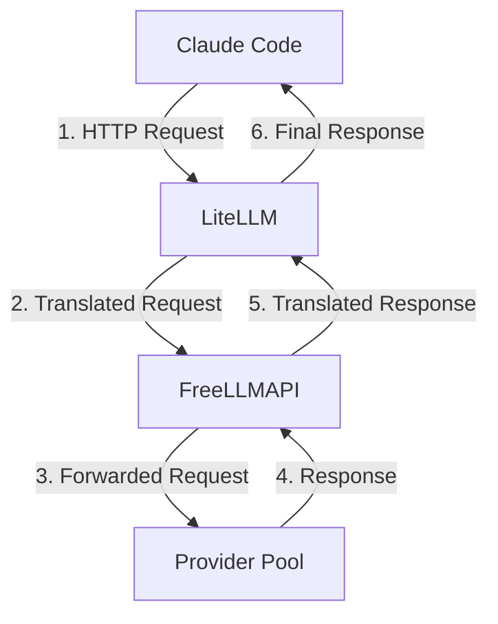
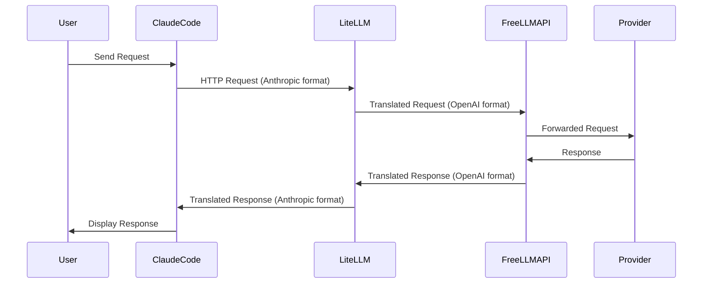

# Architecture Guide

This document provides a detailed explanation of the architecture and how the components interact.

## Overview

The architecture consists of four main components that work together to provide a seamless experience for Claude Code users:

1. **Claude Code**: The user-facing application
2. **LiteLLM**: The compatibility bridge
3. **FreeLLMAPI**: The API gateway
4. **Provider Pool**: The collection of models

## Architecture Diagram

## Detailed Component Descriptions

### 1. Claude Code

**Role**: User-facing application that interacts with the user.

**Functionality**:

- Sends requests to LiteLLM
- Receives and displays responses
- Handles user interactions

**Key Features**:

- Model selection
- Prompt input
- Response display
- Streaming support

### 2. LiteLLM

**Role**: Compatibility bridge between Claude Code and FreeLLMAPI.

**Functionality**:

- Translates Anthropic-style requests to OpenAI-style requests
- Handles model mapping
- Filters unsupported parameters
- Forwards requests to FreeLLMAPI
- Translates responses back to Anthropic format

**Key Features**:

- Model mapping configuration
- Parameter filtering
- Request/response translation
- Multiple provider support

### 3. FreeLLMAPI

**Role**: API gateway that provides an OpenAI-style chat completions API.

**Functionality**:

- Receives requests from LiteLLM
- Forwards requests to appropriate providers in the pool
- Returns responses to LiteLLM
- Handles provider health checks

**Key Features**:

- Provider pool management
- Request routing
- Health monitoring
- Load balancing

### 4. Provider Pool

**Role**: Collection of local and remote models that can be used to fulfill requests.

**Functionality**:

- Processes requests from FreeLLMAPI
- Returns responses to FreeLLMAPI
- Handles model-specific operations

**Key Features**:

- Model hosting
- Request processing
- Response generation
- Model-specific features

## Request Flow

1. **User Interaction**: User sends a request through Claude Code
2. **Request Translation**: LiteLLM translates the request to OpenAI format
3. **Request Forwarding**: FreeLLMAPI forwards the request to an appropriate provider
4. **Request Processing**: The provider processes the request
5. **Response Return**: The provider returns a response to FreeLLMAPI
6. **Response Translation**: FreeLLMAPI translates the response back to OpenAI format
7. **Response Return**: LiteLLM translates the response back to Anthropic format
8. **User Display**: Claude Code displays the final response to the user

## Data Flow

## Key Considerations

1. **Compatibility Layer**: The LiteLLM component is critical for handling the format translation between Anthropic and OpenAI.
2. **Model Mapping**: Proper configuration of model mappings in LiteLLM is essential for correct operation.
3. **Parameter Handling**: LiteLLM must properly filter or transform parameters that are not supported by the target provider.
4. **Error Handling**: Each component should have robust error handling to manage issues that may arise during the request flow.
5. **Performance**: The architecture should be designed with performance in mind, especially considering the additional network hops introduced by the compatibility layer.

## Configuration Requirements

1. **LiteLLM Configuration**:
   - Model mappings
   - Parameter filtering settings
   - API endpoint configuration

2. **FreeLLMAPI Configuration**:
   - Provider pool settings
   - Health check intervals
   - Load balancing strategy

3. **Claude Code Configuration**:
   - API endpoint configuration
   - Model selection settings
   - Streaming preferences

For more details on configuration, see the [Configuration Guide](CONFIGURATION.md).

For advanced model routing scenarios, see the [Advanced Configuration Guide](ADVANCED_CONFIGURATION.md).
