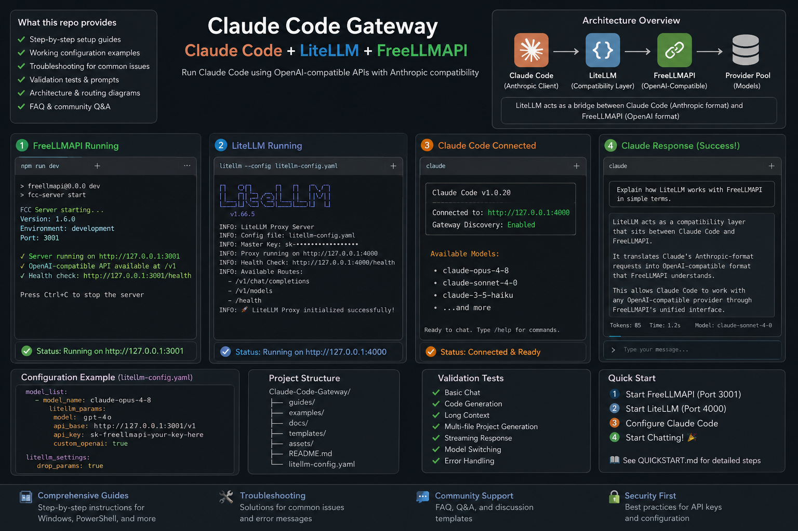
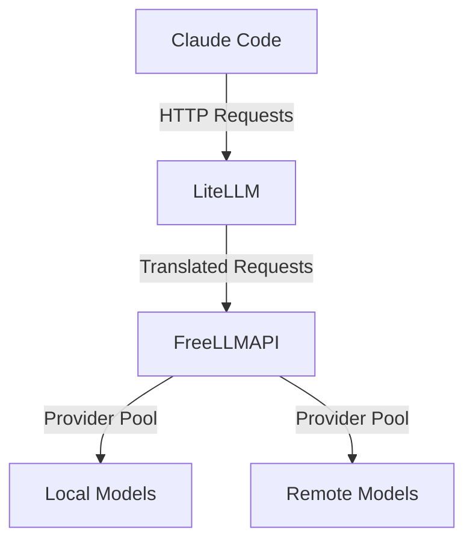

# Claude Code with FreeLLMAPI + LiteLLM Compatibility Bridge

Run Claude Code using FreeLLMAPI + LiteLLM with Anthropic-compatible routing, model translation, troubleshooting guides, and Windows setup instructions.

[Quick Start](#quick-start) | [Architecture](#architecture-overview) | [Troubleshooting](#troubleshooting) | [Validation](#validation)

[](https://opensource.org/licenses/MIT)
[](https://github.com/shashankpandya/claude-code-freellmapi/issues)
[](https://github.com/shashankpandya/claude-code-freellmapi/stargazers)
[](https://github.com/shashankpandya/claude-code-freellmapi/network)

## Why This Repository Exists

Claude Code expects Anthropic-style behavior and request semantics.

FreeLLMAPI is OpenAI-compatible, so it cannot be used directly without translation.

LiteLLM acts as the translation layer between the Anthropic-style client and the OpenAI-compatible gateway.

This repository documents the exact working bridge so the full setup can be reproduced reliably instead of guessed from a generic setup guide.

## Executive Summary

This repository provides a complete guide for setting up Claude Code with FreeLLMAPI and LiteLLM as a compatibility bridge. It solves compatibility issues between Claude Code and different providers by implementing a gateway architecture.

## Architecture Overview

Visual overview:





The architecture consists of:

1. **Claude Code**: The main application that interacts with the user
2. **LiteLLM**: Acts as a compatibility bridge, translating requests from Claude Code to a format that FreeLLMAPI can understand
3. **FreeLLMAPI**: Provides an OpenAI-style chat completions API, forwarding requests to a pool of providers
4. **Provider Pool**: A collection of local and remote models that can be used to fulfill requests

## Quick Start

1. **Install Prerequisites**:
   - Python 3.8+
   - Node.js 16+
   - Git

2. **Clone the Repository**:

   ```powershell
   git clone https://github.com/shashankpandya/claude-code-freellmapi.git
   cd claude-code-freellmapi
   ```

3. **Start Services**:

   ```powershell
   .\examples\combined-startup.ps1
   ```

4. **Run Test Prompts**:
   ```powershell
   .\examples\test-prompts.ps1
   ```

For detailed instructions, see the [Full Installation Guide](#full-installation-guide).

## Full Installation Guide

1. **Install Prerequisites**:
   - Install Python and Node.js
   - Install Git

2. **Clone the Repository**:

   ```powershell
   git clone https://github.com/shashankpandya/claude-code-freellmapi.git
   cd claude-code-freellmapi
   ```

3. **Install Component Dependencies**:

   Install dependencies per component rather than from the repository root. Examples:
   - FreeLLMAPI (if running locally): `cd /path/to/freellmapi && npm install`
   - LiteLLM (if running locally): `cd /path/to/litellm && pip install -r requirements.txt`

   See the component guides for details: [FREELLMAPI_CONFIG.md](FREELLMAPI_CONFIG.md), [LITELLM_CONFIG.md](LITELLM_CONFIG.md)

4. **Start FreeLLMAPI**:

   ```powershell
   .\examples\start-freellmapi.ps1
   ```

5. **Start LiteLLM**:

   ```powershell
   .\examples\start-litellm.ps1
   ```

6. **Start Claude Code**:
   ```powershell
   .\examples\start-claude.ps1
   ```

For more details, see the [Installation Guide](guides/02-installation-windows.md).

## Validation

To validate that everything is working correctly, run the provided test prompts and observe the logs.

For more details, see the [Validation Guide](VALIDATION.md).

## Troubleshooting

If you encounter issues, see the [Troubleshooting Guide](TROUBLESHOOTING.md).

## FAQ

For frequently asked questions, see the [FAQ](FAQ.md).

## Security

For security guidelines, see the [Security Guide](SECURITY.md).

## Contributing

For contribution guidelines, see the [Contributing Guide](CONTRIBUTING.md).

## Community/Support

For community support, see the [Community Guide](COMMUNITY.md).

## Credits and References

For credits and references, see the [Credits Guide](CREDITS.md).
