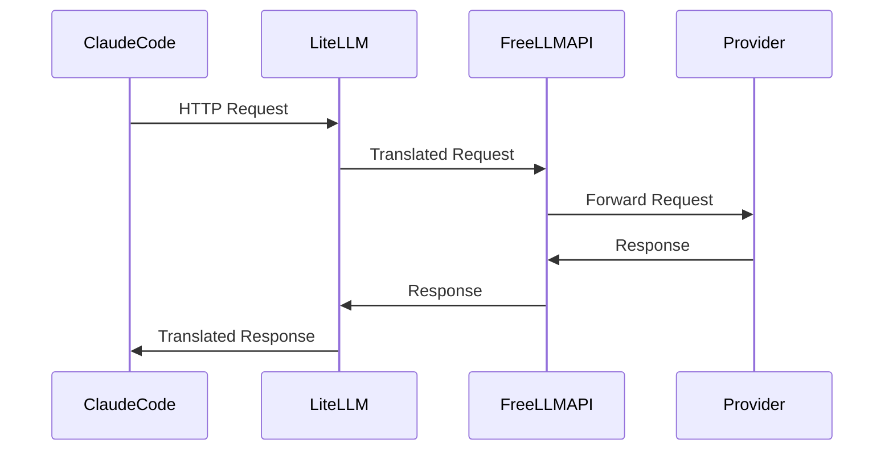

# Architecture

This document provides a detailed explanation of the architecture for running Claude Code with FreeLLMAPI and LiteLLM.

## Overview

The architecture involves three main components:

1. **Claude Code:** The main application that interacts with the user.
2. **LiteLLM:** Acts as a compatibility bridge, translating requests from Claude Code to a format that FreeLLMAPI can understand.
3. **FreeLLMAPI:** Provides an OpenAI-style chat completions API, forwarding requests to a pool of providers.

## Request Flow

## Components

### Claude Code
- **Role:** User-facing application.
- **Function:** Sends requests to LiteLLM and receives responses.

### LiteLLM
- **Role:** Compatibility bridge.
- **Function:** Translates Claude-style requests to OpenAI-style requests and forwards them to FreeLLMAPI.

### FreeLLMAPI
- **Role:** API Gateway.
- **Function:** Forwards requests to the appropriate provider and returns responses.

### Provider Pool
- **Role:** Model hosting.
- **Function:** Processes requests and returns responses using local or remote models.