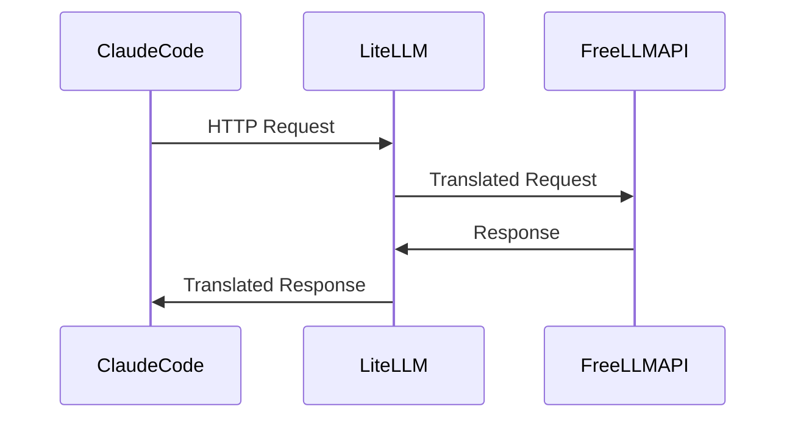

# Compatibility Layer

This document explains the compatibility layer used in this project.

## Overview

The compatibility layer is responsible for translating requests from Claude Code to a format that FreeLLMAPI can understand.

## Components

### LiteLLM

LiteLLM acts as the compatibility bridge between Claude Code and FreeLLMAPI. It translates Claude-style requests to OpenAI-style requests and forwards them to FreeLLMAPI.

## Request Flow



## Configuration

LiteLLM is configured using a YAML file. The configuration file specifies the model mappings and other settings.

```yaml
litellm_settings:
  drop_params: true

model_list:
  - model_name: claude-opus-4-8
    litellm_params:
      model: custom_openai/claude-opus-4-8
  - model_name: claude-sonnet-4-0
    litellm_params:
      model: custom_openai/claude-sonnet-4-0
  - model_name: claude-3-5-haiku
    litellm_params:
      model: custom_openai/claude-3-5-haiku

general_settings:
  master_key: YOUR_LITELLM_MASTER_KEY # Placeholder - replace with your actual key
  custom_openai:
    base_url: "http://localhost:8082"
```
