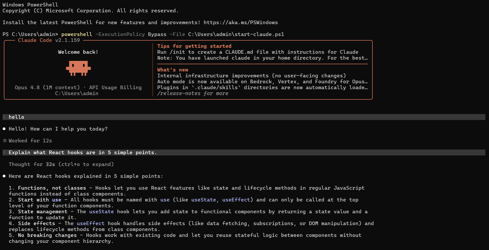
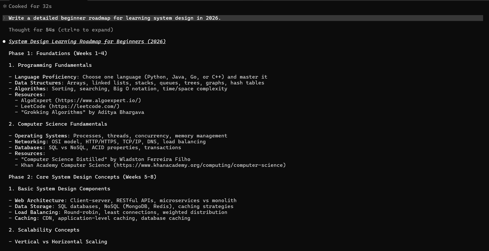
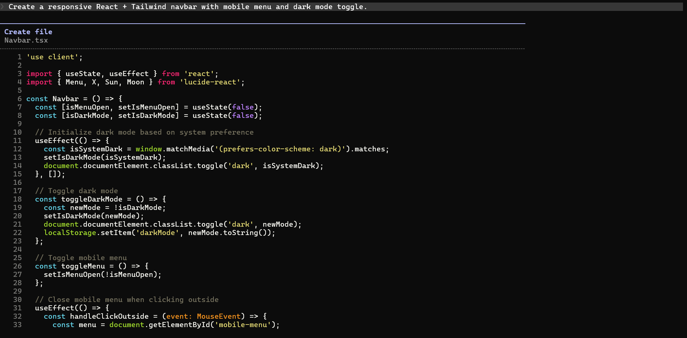
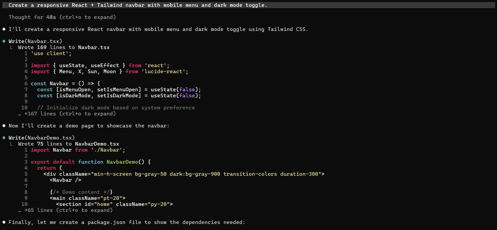
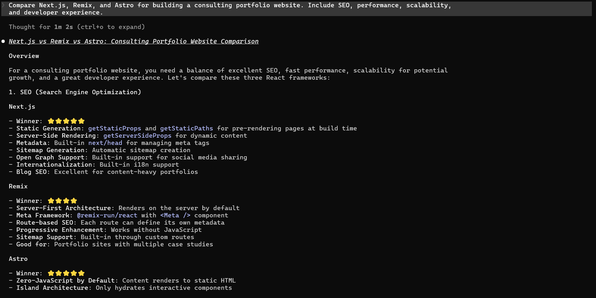
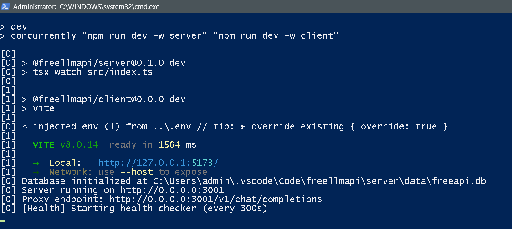
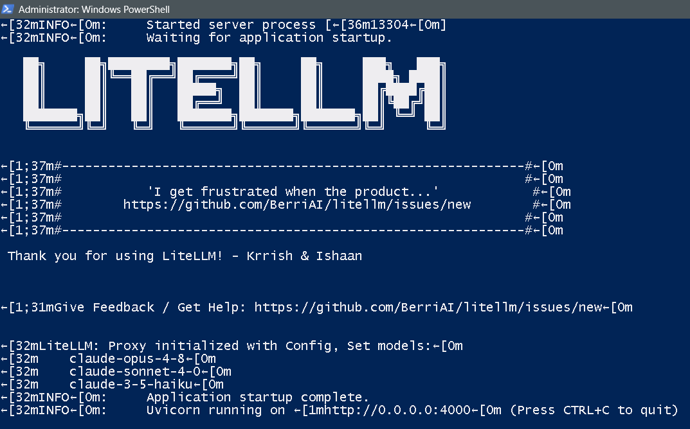
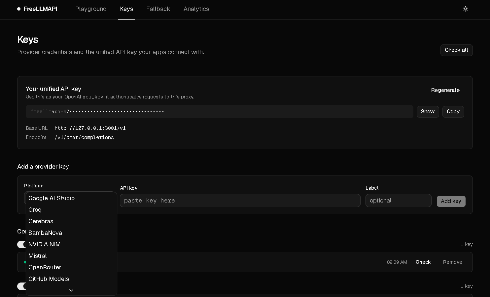
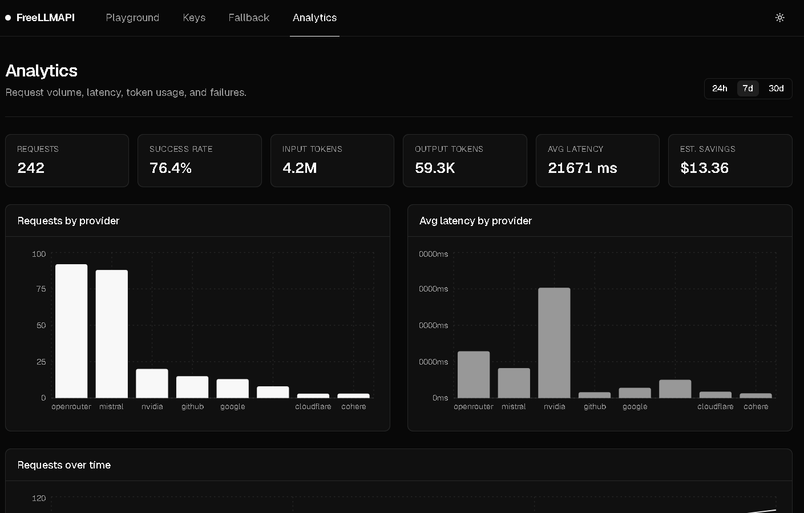
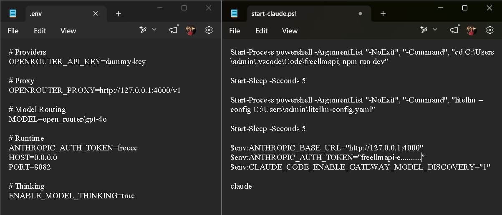

# Setup Showcase: Visual Reference

This document provides a visual reference of a successful Claude Code + FreeLLMAPI + LiteLLM setup. These screenshots from a live environment demonstrate the expected behavior, terminal outputs, and configuration flow.

---

## 1. Initial Setup and Environment

These images show the initial terminal setup and the environment where the services are being initialized.

*Figure 1: Initial environment check and directory preparation.*

*Figure 2: Verifying prerequisites and cloning the necessary components.*

---

## 2. Service Initialization

Starting the gateway services (FreeLLMAPI and LiteLLM) and confirming they are listening on the correct ports.

*Figure 3: Initializing the FreeLLMAPI gateway.*

*Figure 4: Starting LiteLLM to act as the compatibility bridge.*

---

## 3. Configuration and Model Mapping

Confirming that model mappings are correctly loaded and that the translation layer is active.

*Figure 5: Reviewing the LiteLLM configuration and model translations.*

*Figure 6: Verifying that backend models are recognized by FreeLLMAPI.*

---

## 4. Claude Code Interaction

Running Claude Code and observing the successful translation of requests through the bridge.

*Figure 7: First interaction with Claude Code pointing to the local bridge.*

*Figure 8: Claude Code receiving responses translated from the OpenAI-compatible backend.*

---

## 5. Validation and Success

Final validation checks showing that the end-to-end flow is functional and stable.

*Figure 9: Running the validation suite to confirm connectivity and response quality.*

*Figure 10: Successful completion of complex tasks via the compatibility bridge.*

---

> **Note**: These screenshots are provided by the community to assist new users. API keys and sensitive information have been redacted for security.

[Back to Quick Start](../QUICKSTART.md) | [Back to README](../README.md)
